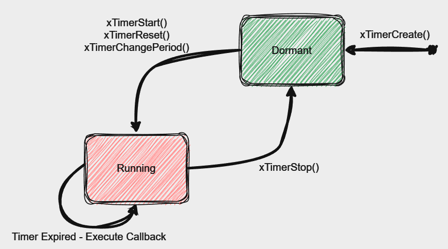

### ⬛ Refer
* "process_and_steps.md" file for implementation/documentation.

---
### ✔️ Improvements done:

✅ Naming of Variables

✅ Passing by value (was reference actually needed?)

✅ Not relying on compiler for implicit typecast done explicit

✅ Instead of dividing anything, take the reciprocal of it and multiply it

✅ Global definitions/declarations (actually needed?) 

✅ Returning the value from function (exact point of execution it should be returned - ◽ {scope} )

✅ Using local variables (imp factors on which to be decided?)

---

###  🟥 Think about below points:
* Consideration of Interrupts during execution
* Looking more into ADC calibration function
* Alternative to vTaskDelay() - use of State Machine / PWM
* Think upon use of Auto Reload Software Timer?, could have used One Shot Software Timer?

---
### ◽ Below chart gives an idea about overall functioning of different software components

### 🚀 FreeRTOS : Auto-Reload Software Timer

